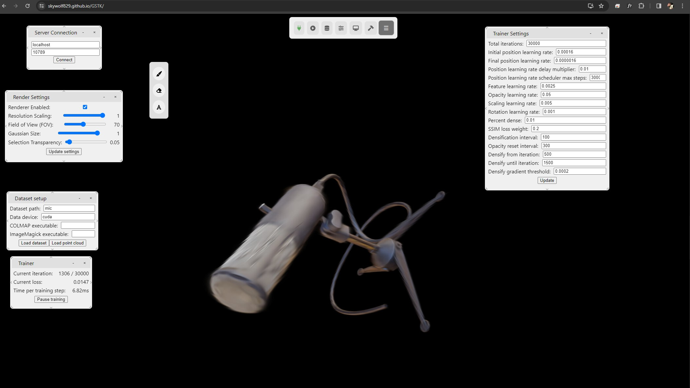

# GSTK
This is Gaussian Splatting Toolkit - one application for creating a dataset, training a model, editing the gaussians, and fine tuning.
We also (plan to) support novel research implementations for gaussian splatting, such as compression-aware training ([Niedermayr et al. 2024](https://arxiv.org/abs/2401.02436)) and DreamGaussian ([Tang et al. 2024](https://dreamgaussian.github.io/)), so you at home can use a simple application to try new techniques.

## Why GSTK?
Many [great 3DGS tools exist](https://github.com/MrNeRF/awesome-3D-gaussian-splatting) for editing a trained [3DGS model](https://repo-sam.inria.fr/fungraph/3d-gaussian-splatting/) for use in other rendering software such as Blender, Unity, Unreal, or on the web.
However, some of these edits can reduce the final quality.
In our toolkit, you can perform these edits at any point during or after training, and continue training afterward to fine-tune the model once the edits are complete.
This way, quality can be preserved.

Conversely, we can help the 3DGS model perform better with a human-in-the-loop training routine! 
3DGS will often create floaters placed inconveniently to reduce training loss, or make surfaces that aren't flat due to lack of training viewpoints.
As a human with an innate understanding of the scene, we can help models perform better (and create better geometry) by adjusting gaussians during training.

## How does GSTK work?
Our toolkit uses a backend-frontend framework.
All of the training and rendering is hosted on a CUDA-accelerated backend, while the viewing, interacting, and editing is handled in a frontend application.
You can run both of these on one machine (your own desktop), or you can use a remote server with a CUDA device and connect to it with your laptop.
Similarly, you can run the backend on your PC in your office, and edit the training from your laptop in a coffee shop.

## How do I use it?
Installing and running GSTK is simple.
On the machine with a CUDA enabled graphics card, see `src/backend` for installation instructions, which amounts to one command line instruction.
Similarly, on whatever machine should run the frontend, see `src/frontend` for installation instructions.

When you're ready to start, start the backend script and frontend application, and start training!

### 1. Connecting to the backend
Once you start the application (while the backend server is running), the first thing you need to do is connect to the server.


In the server connection window, enter the IP and port that the server is running on (more information in the README in `src/backend`).
If you do not see the server connection window, open it with `View > Server connection`.


Once verifying the IP and port are correct, hit connect.
You should be greeted with a pop-up verifying you have successfully connected to the server.


### 2. Loading your dataset
Now that you've connected to the server, the next step is to load your dataset!
Place your dataset in the `data` folder.
We support 3 kinds of datasets:
1. COLMAP datasets. 
These are datasets created with [COLMAP](https://colmap.github.io/index.html). 
The result is a set of images, camera positions, a point cloud, and colors for the points. 
These are used as the tools to initialize and train the model.
You can create your own with `src/backend/convert.py` after installing COLMAP with only a directory of images.
The (important parts of the) directory structure is assumed to look like this:
```
<dataset_name>
    |images
        |im1.jpg
        |im2.jpg
        |...
    |sparse
        |0
            |cameras.bin
            |images.bin
            |points3D.bin
            |project.ini
```
2. Blender datasets. 
These are datasets similar to those created for some NeRF models. 
The directory structure is assumed to look like this:
```
<dataset_name>
    |test
        |test_im1.jpg
        |test_im2.jpg
        |...
    |train
        |train_im1.jpg
        |train_im2.jpg
        |...
    |val
        |val_im1.jpg
        |val_im2.jpg
        |...
    |transforms_test.json
    |transforms_train.json
    |transforms_val.json
```
3. Image folder. 
In the case you've captured your own images for a dataset and haven't processed them with COLMAP yet, we also support doing this in GSTK so long as you have installed COLMAP on the server machine.
Organize all images into a single folder like so, and our app will process it using COLMAP into the colmap dataset:
```
<dataset_name>
    |im1.jpg
    |im2.jpg
    |...
```

While loading your dataset (which may take between 15 seconds and 1 minute depending on size, and up to 10 minutes if running COLMAP), you will see a loading sign.


Once it is loaded properly, the sign will disappear and you are ready to train!

### 3. Training your model

Finally, you can begin training your model.
Find the training window, and click "Start training".


As you train, the gaussian model will refine itself in the viewing window.
At any point, you can click "Stop training" to pause the model training so you may make edits if necessary.



### 4. Editing your model

At any point during training, you may pause model training and perform edits to the model.
These are accessed through the edit window, shown below outlined in red.


When clicking on one of the edit operations, a window will pop up related to that operations settings.
At the same time, a selector cube may appear in the scene.
Depending on the edit operation, you can move the selector cube to the area you'd like to apply the edit, and scale/rotate the selector as necessary.


Training can seamlessly resume after editing, or you may be happy and can save the model with `Model > Save model`, which will create `<model_name>.ply` in the `savedModels` folder on the server.

## Acknowledgements

Many thanks to the authors of 3DGS who have created a great work!
We borrow and adapt a majority of [their code](https://github.com/graphdeco-inria/gaussian-splatting) to fit in this application.
Since we do make numerous changes to their code's structure and CUDA API for the model, we do ship our own version of their model and training code, but acknowledge that a large chunk of our code is unchanged from the original implementation.

We also would like to thank any users that contribute and/or bring suggestions or comments to the GitHub issues page!